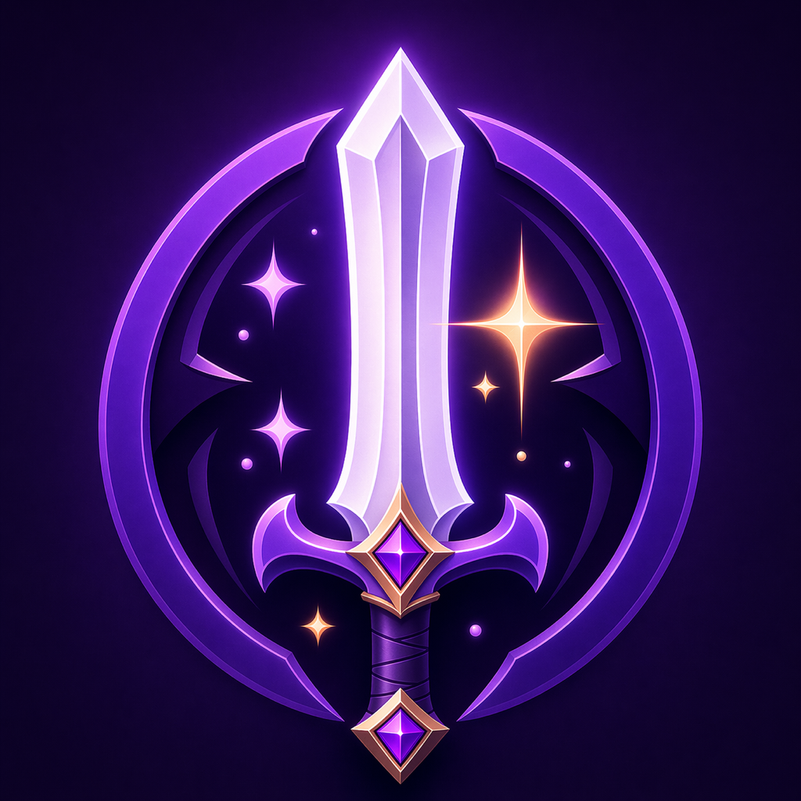
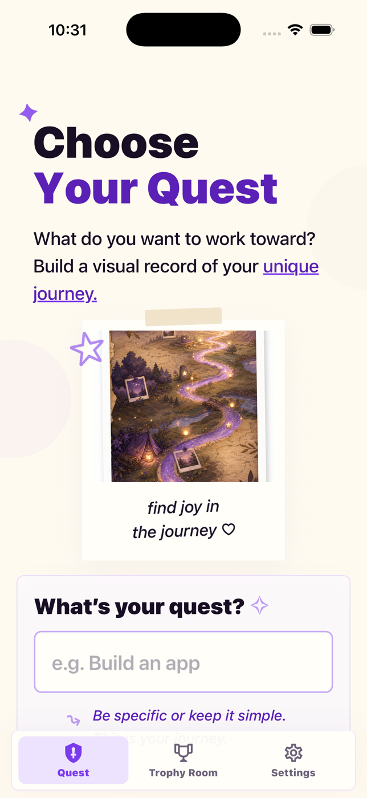
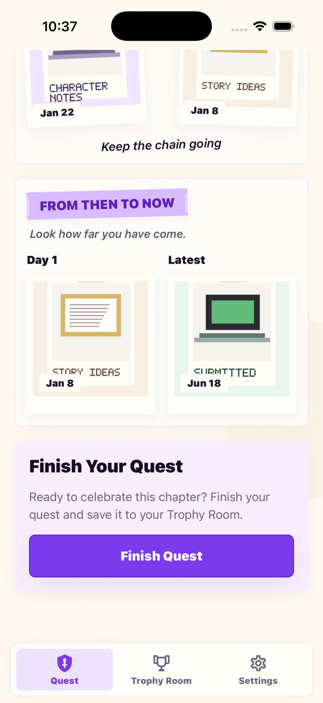
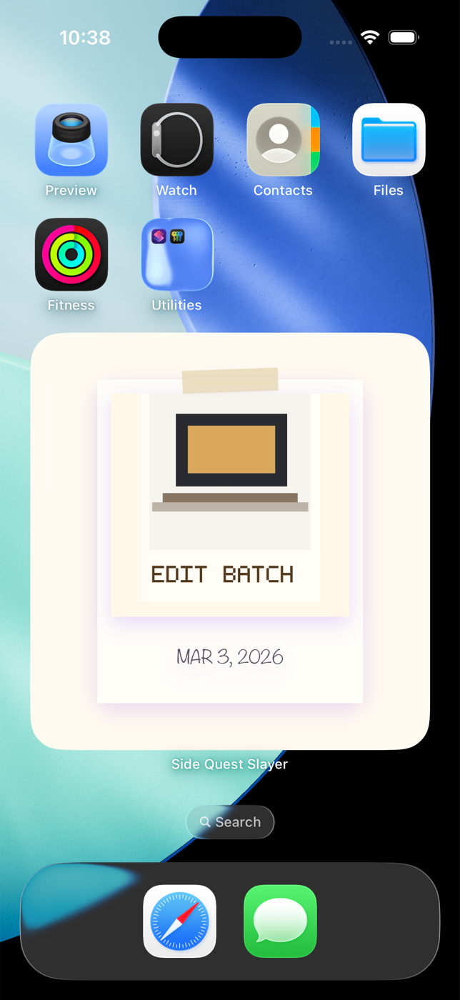

<p align="center">
  
</p>

<h1 align="center">Side Quest Slayer</h1>

<p align="center">
  <strong>Turn the steps between your vision and the finish line into a story you can see.</strong>
</p>

<p align="center">
  A private, local-first progress journal for documenting the small wins, brave attempts, and everyday proof behind meaningful goals.
</p>

<p align="center">
  <a href="https://apps.apple.com/app/id6782196423"><strong>Download on the App Store</strong></a>
  ·
  <a href="https://maya-loves-code.github.io/side-quest-slayer/privacy-policy.html">Privacy Policy</a>
  ·
  <a href="https://www.youtube.com/@MayaBello">Maya on YouTube</a>
</p>

<p align="center">
  
  
  
</p>

<table>
  <tr>
    <td width="33%" align="center">
      
    </td>
    <td width="33%" align="center">
      
    </td>
    <td width="33%" align="center">
      
    </td>
  </tr>
  <tr>
    <td align="center"><strong>Choose your quest</strong></td>
    <td align="center"><strong>See how far you have come</strong></td>
    <td align="center"><strong>Keep progress in sight</strong></td>
  </tr>
</table>

## Your progress deserves to be remembered

Goals tend to get celebrated at the finish line. Side Quest Slayer is built for everything it takes to get there.

Choose a quest—write a book, train for a race, build a business, learn a skill—and collect visual proof as you go. Each photo and reflection becomes another page in a private scrapbook that makes slow, quiet progress easier to notice and celebrate.

## What you can do

- **Track multiple quests.** Move between active goals without losing your place.
- **Capture proof in the moment.** Take a photo with the full-screen camera, including pinch-to-zoom support.
- **Bring in earlier wins.** Import photos from your library, use their capture dates as suggestions, and confirm or adjust when each moment happened.
- **Add the story behind the photo.** Pair each moment with an optional reflection of up to 280 characters.
- **Watch the journey take shape.** Browse a scrapbook-style timeline grouped by month and compare your first moment with your latest one.
- **Finish with intention.** Complete a quest and preserve its photos, reflections, highlights, and timeline in the Trophy Room.
- **Revisit memories from your Home Screen.** The native Quest Memories widget rotates through progress photos and deep-links directly to the matching moment.
- **Build a gentle rhythm.** Read a fresh daily encouragement and opt into a reminder at the time that works for you.

## Private by design

Side Quest Slayer does not require an account and does not use ads, analytics, cloud sync, or remote photo storage. Quest titles, reflections, settings, and photos stay in local app storage on your device.

Permissions are requested in context: camera and photo access appear only when you choose those actions, and notification permission is requested only after you opt into reminders. Android app-data backup is disabled to avoid intentionally copying private quest data off-device.

Read the full [Privacy Policy](https://maya-loves-code.github.io/side-quest-slayer/privacy-policy.html).

## How it is built

| Layer | Implementation |
| --- | --- |
| App experience | Expo, React Native, and TypeScript |
| Quest data | Local SQLite database with small, forward-compatible migrations |
| Photo storage | App-owned local files with stable, container-safe references |
| iOS widget | SwiftUI and WidgetKit backed by an App Group cache |
| Deep linking | Custom `sidequestslayer://` URLs that open the exact widget memory |
| Device features | Camera, photo library metadata, local notifications, and native date picking |

The repository also includes development-only demo-data tools, seeded photo journeys, and a Remotion project for producing product videos without exposing real user data.

## Run locally

### Prerequisites

- Node.js and npm
- Xcode for the iOS app and Quest Memories widget
- Android Studio for a native Android build

### Install and start

```bash
npm install
npm run start
```

Run a native development build when testing the widget or other native integrations:

```bash
npm run ios
# or
npm run android
```

Validate the TypeScript project with:

```bash
npm run typecheck
```

## About Maya

[Maya Bello](https://www.youtube.com/@MayaBello) is a software engineer and creator who shares the real process of learning, building, and shipping technology. Follow her on YouTube for practical coding, tech, and app-building stories—and a look behind the work that turns ideas like Side Quest Slayer into real products.

---

<p align="center">
  <strong>Progress is not one perfect moment. It is every step you kept showing up for.</strong>
</p>
